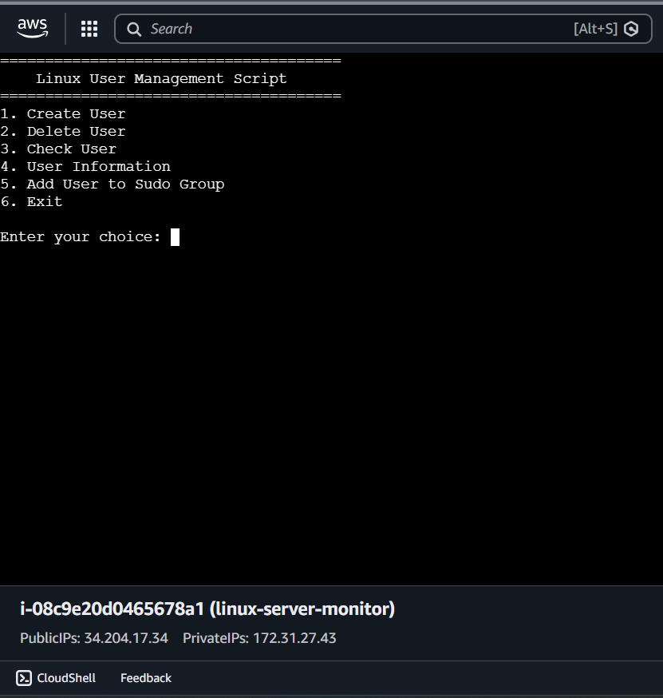
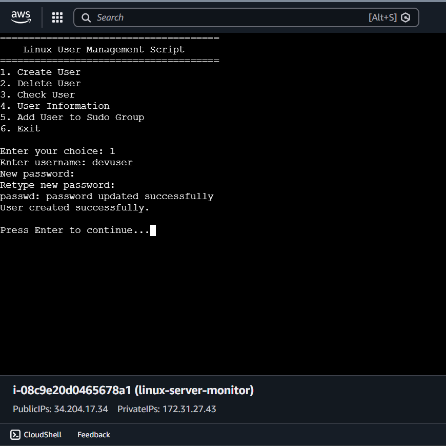
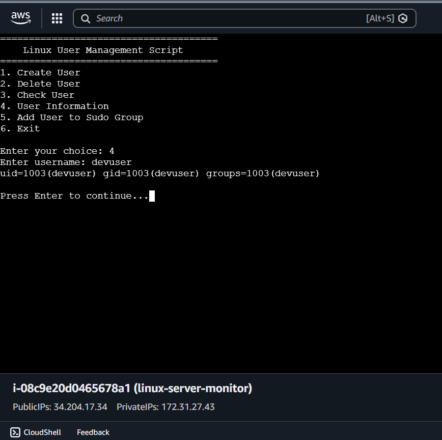
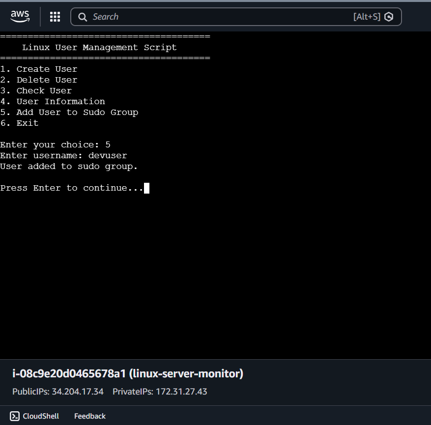

# Linux User Management Script

A Bash script that automates common Linux user management tasks. The script provides an interactive menu for creating, deleting, checking, and managing users.

## Features

- Create a new user
- Delete an existing user
- Check if a user exists
- Display user information
- Add a user to the sudo group
- Interactive menu-driven interface

## Technologies Used

- Ubuntu Linux
- Bash Scripting
- Linux User Management Commands
- AWS EC2
- Git & GitHub

## Project Structure

```
linux-user-management/
│── user_management.sh
│── README.md
│── .gitignore
└── screenshots/
    ├── 01-main-menu.png
    ├── 02-create-user.png
    ├── 03-user-information.png
    ├── 04-add-sudo-group.png
    └── 05-delete-user.png
```

## How to Run

Make the script executable.

```bash
chmod +x user_management.sh
```

Run the script.

```bash
./user_management.sh
```

## Menu Options

1. Create User
2. Delete User
3. Check User
4. User Information
5. Add User to Sudo Group
6. Exit

## Screenshots

### Image 1: Main Menu

Displays the interactive user management menu.



### Image 2: Create User

Shows the creation of a new Linux user.



### Image 3: User Information

Displays information about an existing user.



### Image 4: Add User to Sudo Group

Shows a user being added to the sudo group.



## Author

Sajida Shaik